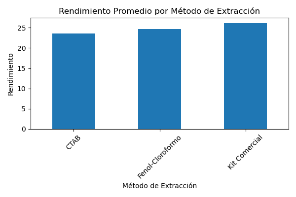

# dna_extraction_analysis
Miniproject comparing DNA extraction methods based on yield and purity using Python and pandas

This miniproject analyzes different DNA extraction methods across various plant species, evaluating two key metrics:
- Yield (% of DNA extracted)
- Purity (A260/A280 ratio)

## Objective
Determine which DNA extraction method provides the best yield and quality for each species.

## DNA Extraction Methods
- **CTAB (Cetyltrimethylammonium Bromide):** A traditional method using detergents to lyse plant cells and remove polysaccharides.
- **Phenol-Chloroform:** An organic extraction technique that separates proteins and other contaminants from nucleic acids.
- **Comercial Kit:** A standardized and convenient method offered by biotech companies, usually based on spin column purification.

*Note: The data used in this project is simulated and intended for educational and analytical practice purposes only.*

## Analysis Performed
- Grouping by species and method
- Average yield and purity calculation
- Identification of the best method per species
- Visualization with bar charts

## Project Structure
- "comparacion_metodos_extraccion_adn.ipynb": Notebook with the complete analysis
- "mejores_metodos_por_especie.csv": Final resulta showing the best methods for each species
- "rendimiento_por_metodo.png: Bar chart showing average yield per method

## Visualization

